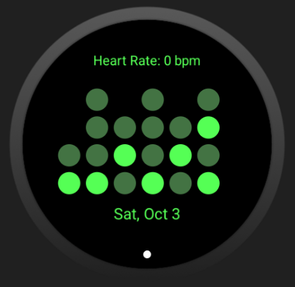

# binaryWatchFace Project

## Build Status

### Goal
 - This is a binary watchface that is free and open-source with the time in binary dot format, your current heart rate for exercising, and the current date.

### Screenshot
